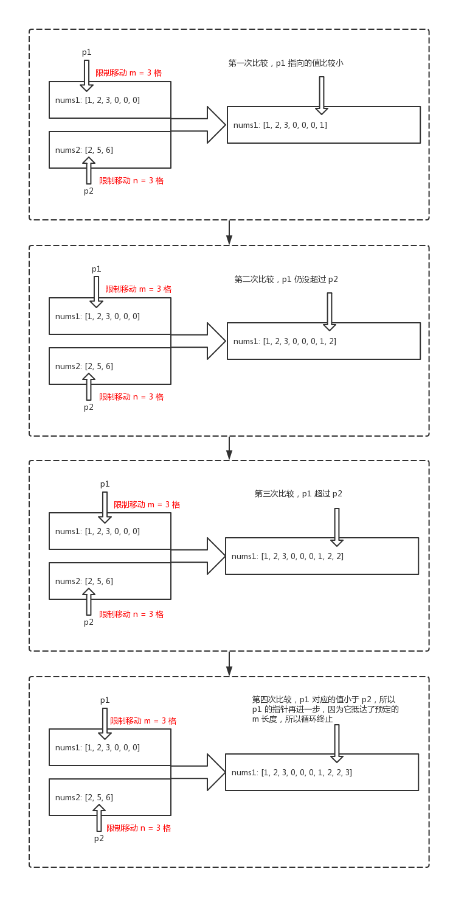

# 面试题

### 1. 两数之和

> 真题描述： 给定一个整数数组 nums 和一个目标值 target，请你在该数组中找出和为目标值的那 两个 整数，并返回他们的数组下标。
示例：
  给定 nums = [2, 7, 11, 15], target = 9
  因为 nums[0] + nums[1] = 2 + 7 = 9
  所以返回 [0, 1]
> 几乎所有的两数之和问题都可以转换为求差问题

```js
const twoSum = function(nums, target) {
    // 这里我用对象来模拟 map 的能力
    const diffs = {}
    // 缓存数组长度
    const len = nums.length
    // 遍历数组
    for(let i=0;i<len;i++) {
        // 判断当前值对应的 target 差值是否存在（是否已遍历过）
        if(diffs[target-nums[i]]!==undefined) {
            // 若有对应差值，那么答案get！
            return [diffs[target - nums[i]], i]
        }
        // 若没有对应差值，则记录当前值
        diffs[nums[i]]=i
    }
};

```

### 2. 合并两个有序数组
> 真题描述：给你两个有序整数数组 nums1 和 nums2，请你将 nums2 合并到 nums1 中，使 nums1 成为一个有序数组。
  解题思路：采用双指针法，首先用p1(指针1) 指向 nums1 的开头，p2(指针2)指向num2的开头。
  用 p1 对应的值和 p2 进行比较，将最小的值放入都输出数组中。每次比较，移动对应的 p1 或者 p2：

  

  假设我们一开始执行的是：merge([1,2,3,0,0,0], 3, [2,5,6], 3)，那么：

    ```js
    while (count1 < m && count2 < n) {
    if (nums1[count1] > nums2[count2]) {
        nums1.push(nums2[count2++]);
    } else {
        nums1.push(nums1[count1++]);
    }
    }
    ```
经过 while 的遍历之后，我们把基本能添加的值，都添加进 nums1 了。

然后，我们再进行一次判断，是 nums1 没有遍历完还是 nums2 没有遍历完，如果没遍历完，那么就从那位开始，把剩下的通过 slice() 切割出来后，再通过解构赋值，将其 push() 到 nums1 即可：

```js
if (count1 < m) {
  nums1.push(...nums1.slice(count1, m));
}

if (count2 < n) {
  nums1.push(...nums2.slice(count2, n));
}
```
最后，我们通过 nums1.splice(0, len) 将 nums1 原本的内容删掉，就可以获得最终结果了。
```js
/**
 * 采用双指针法
 * @param {number[]} nums1
 * @param {number} m
 * @param {number[]} nums2
 * @param {number} n
 * @return {void} Do not return anything, modify nums1 in-place instead.
 */
const merge = function(nums1, m, nums2, n) {
    // 初始化两个指针的指向，初始化 nums1 尾部索引k
    let i = m - 1, j = n - 1, k = m + n - 1
    // 当两个数组都没遍历完时，指针同步移动
    while(i >= 0 && j >= 0) {
        // 取较大的值，从末尾往前填补
        if(nums1[i] >= nums2[j]) {
            nums1[k] = nums1[i] 
            i-- 
            k--
        } else {
            nums1[k] = nums2[j] 
            j-- 
            k--
        }
    }
    
    // nums2 留下的情况，特殊处理一下 
    while(j>=0) {
        nums1[k] = nums2[j]  
        k-- 
        j--
    }
};
var merge = function (nums1, m, nums2, n) {
  let count1 = 0;
  let count2 = 0;
  let len = nums1.length;
  while (count1 < m && count2 < n) {
    if (nums1[count1] > nums2[count2]) {
      nums1.push(nums2[count2]);
      count2 += 1;
    } else {
      nums1.push(nums1[count1]);
      count1 += 1;
    }
  }

  if (count1 < m) {
    nums1.push(...nums1.slice(count1, m));
  }

  if (count2 < n) {
    nums1.push(...nums2.slice(count2, n));
  }

  nums1.splice(0, len);
  return nums1;
};


```


### 3. 
> 已知每个服务启动都需要一定时间，且每个服务可能依赖其他的服务启动。现给定一个n*n的二维数组arr，
 arr[i][i]表示i服务启动需要的时间，arr[i][j]表示i服务是否依赖j服务，如果为1表示依赖，
0表示不依赖。当服务依赖的服务彼此之间没有依赖关系时，这些服务可以并行启动。
 题目保证服务之间不存在循环依赖关系，求服务k（1<=k<=n）启动需要的时间。


